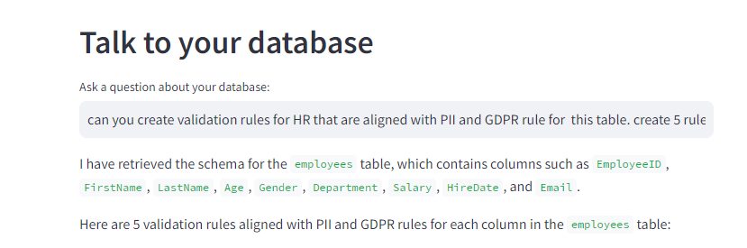
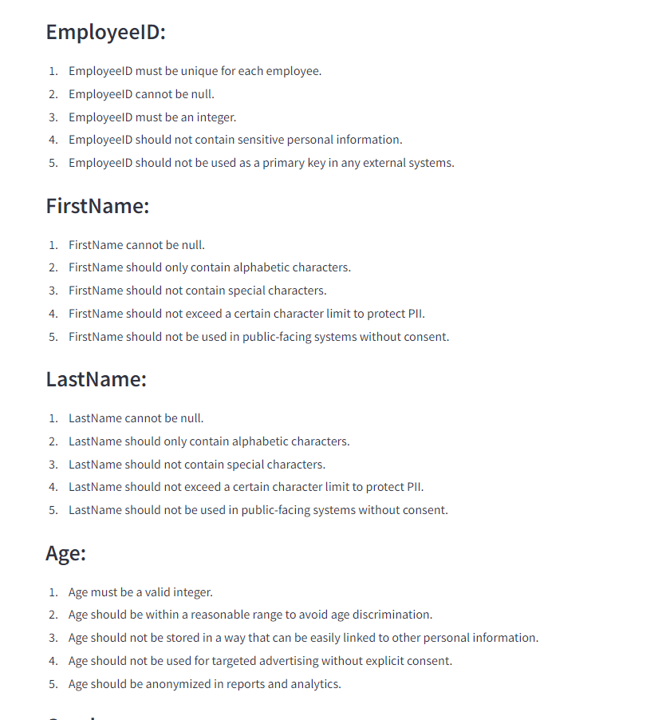
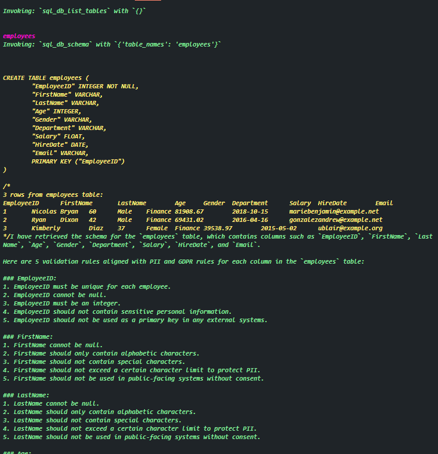

# Talk to Your Database

This application allows users to interact with their SQL databases through a conversational interface. Leveraging the power of OpenAI's language model and the LangChain framework, the app provides a user-friendly way to query databases and retrieve information using natural language.

## Key Features

### Conversational Interface
- **Natural Language Queries**: Users can ask questions in plain English, and the app will translate these queries into SQL commands to interact with the database.
- **User-Friendly**: Simplifies the process of querying a database, making it accessible even for those who are not familiar with SQL.

### Integration with SQL Databases
- **SQLAlchemy Integration**: Utilizes SQLAlchemy to manage database connections and queries.
- **Support for Multiple Databases**: Although this example uses an SQLite database, the framework supports various types of SQL databases.

### Streamlit Integration
- **Interactive UI**: Streamlit provides a clean and interactive user interface for inputting queries and displaying results.
- **Real-Time Feedback**: Users receive real-time feedback and results for their queries.

### Powered by OpenAI
- **Advanced Language Model**: Uses OpenAI's language model to understand and process natural language queries.
- **Temperature Control**: Allows for adjusting the creativity and variability of the responses from the language model.

## How It Works

1. **Load Environment Variables**:
   - The application starts by loading environment variables using the `dotenv` package.

2. **Streamlit Configuration**:
   - The app sets up the Streamlit configuration for the web interface.

3. **Database Connection**:
   - Connects to an SQLite database using SQLAlchemy. The database contains HR records for querying.

4. **Language Model Initialization**:
   - Initializes OpenAI's language model with specific parameters for generating responses.

5. **Create SQL Agent**:
   - Uses LangChain to create an SQL agent that can process natural language queries and convert them into SQL commands.

6. **User Interaction**:
   - Users input their queries through a text input field. The app processes these queries and returns the relevant information from the database.

## Benefits of Prompting

- **Accessibility**: Makes data querying accessible to non-technical users by allowing them to use natural language instead of SQL.
- **Efficiency**: Saves time and effort by automating the translation of natural language queries into SQL.
- **Flexibility**: Can handle a wide range of queries and provide meaningful responses, thanks to the underlying language model.
- **Scalability**: The framework can be extended to support additional databases and more complex queries.

## Example Usage

1. **Ask a Question**:
   - Users can ask questions like can you create validation rules for HR that are aligned with PII and GDPR rule for  this table. create 5 rules for each column ensure each column has 10 validation rules as a minimum" or "How many employees were hired in the last year?".

   

2. **Receive Results**:
   - The app processes the question, converts it into an SQL query, executes the query on the database, and displays the results.

   

3.  **CLI Example**:
    - Using `verbose = True` in your script will result in the following

   

## Conclusion

This app demonstrates how natural language processing and AI can simplify database interactions. By combining the strengths of OpenAI's language model with SQLAlchemy and Streamlit, it provides a powerful tool for querying databases in an intuitive and user-friendly manner.

For any issues or feature requests, please open an issue on the project's [GitHub repository](https://github.com/YavinOwens/Streamlit_openai_chatbots/issues).
