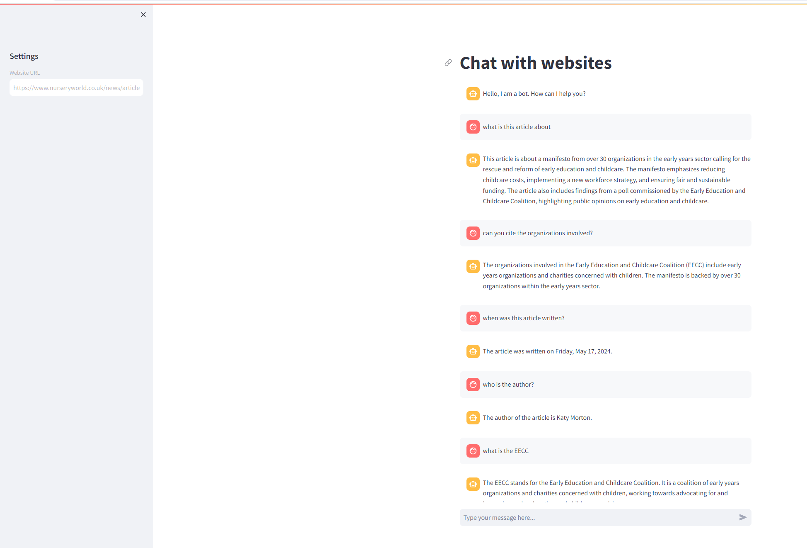

# Talk with Websites

This application allows users to interact with website content through a conversational interface. Leveraging FAISS for vector storage and OpenAI for embeddings and chat models, the app enables users to upload a website URL, process its content, and engage in a meaningful dialogue about the content.

## Features

- **Web Content Loader**: Fetches and processes content from a given website URL.
- **Text Chunking**: Splits the website content into manageable chunks for efficient processing.
- **Vector Storage**: Uses FAISS to create a vector store from text chunks with OpenAI embeddings.
- **Conversational Interface**: Allows users to ask questions and receive context-aware responses.
- **Chat History**: Maintains a conversation history to provide context for subsequent queries.
- **Streamlit Integration**: Provides a user-friendly interface for input and interaction.

## Key Functions

### `get_vectorstore_from_url(url)`

Fetches content from the specified URL, splits it into chunks, and creates a FAISS vector store using OpenAI embeddings.

### `get_context_retriever_chain(vector_store)`

Creates a history-aware retriever chain that generates search queries based on the conversation history to fetch relevant information.

### `get_conversational_rag_chain(retriever_chain)`

Creates a conversational retrieval-augmented generation (RAG) chain to handle user queries and provide context-based answers.

### `get_response(user_input)`

Uses the retriever and RAG chains to generate a response to the user's input, leveraging the conversation history for context.

## How to Run the App

1. **Install Dependencies**

   Make sure you have the required libraries installed. You can use the following command to install them:
   
   ```sh
   pip install streamlit langchain langchain-openai beautifulsoup4 python-dotenv
   ```

2. **Set Up Environment Variables**

   Create a `.env` file in the root directory of your project and add your OpenAI API key:
   
   ```
   OPENAI_API_KEY=your_openai_api_key
   ```

3. **Run the App**

   Use the following command to run the Streamlit app:
   
   ```sh
   streamlit run app.py
   ```

4. **Using the App**

   - **Enter Website URL**: In the sidebar, input the URL of the website you want to chat with.
   - **Process Content**: The app will process the website content and prepare it for interaction.
   - **Ask Questions**: Use the text input at the bottom to type your questions and receive answers based on the website content.

## Example Usage

1. **Input a Website URL**


2. **Ask Questions**



## Conclusion

This app provides a powerful way to interact with web content through a conversational interface. By leveraging FAISS and OpenAI technologies, it offers efficient and context-aware responses to user queries.

For any issues or feature requests, please open an issue on the project's repo.
